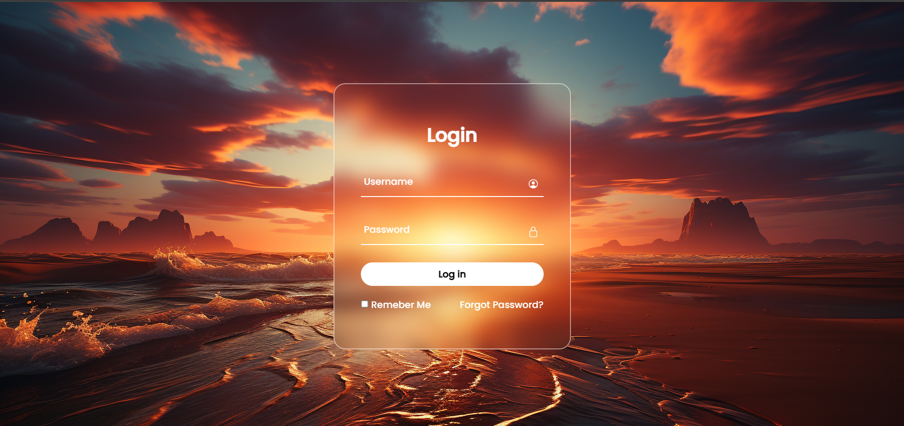

# Login-Form-113

A clean, responsive login form built using HTML, CSS, and JavaScript.

## Overview

This repository contains a simple, modern login form intended as a small UI project or starter component for web projects. It demonstrates layout, styling, and light JavaScript for form interactions and validation.

## Preview

See the screenshot above for a preview of the form.

## Features

- Responsive layout that works on desktop and mobile
- Clean, modern styling using CSS
- Basic client-side validation with JavaScript
- Easy to customize and integrate into larger projects

## Files

- `index.html` — markup for the login form
- `styles.css` — styling and layout
- `script.js` — form interaction and validation logic
- `Screenshot 2024-08-11 195853.png` — preview image used in this README

## Usage

1. Clone the repository:

   git clone https://github.com/BinaryVortex/Login-Form-113.git

2. Open `index.html` in your browser (double-click or use a local server).

3. Edit `styles.css` and `script.js` to customize the look and behavior.

## Customization

- Change colors, fonts, spacing in `styles.css` to match your design system.
- Replace the logo or background with your assets.
- Hook the form to a backend authentication endpoint by modifying the form `action` or handling submission in `script.js`.

## Contributing

Contributions are welcome. If you find a bug or want to add a feature, please open an issue or submit a pull request.

## License

This project is provided under the MIT License. See the `LICENSE` file for details (or add one if missing).

## Contact

Created by BinaryVortex. For questions or suggestions, open an issue on this repository.
